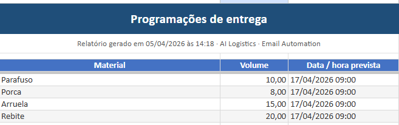

# AI Logistics · Email Automation

<div align="center">


**Transformar e-mails de logística em relatório organizado e lembretes na agenda — com apoio de inteligência artificial.**

[O que faz](#o-que-faz) · [Resultado](#resultado-exemplo-de-saída) · [Como rodar](#como-rodar-o-projeto) · [Tecnologias](#tecnologias)

</div>

---

## Em poucas palavras

Este projeto lê **e-mails** na sua caixa (Gmail), **entende o texto** (incluindo listas com vários materiais e quantidades) e organiza tudo em um **relatório em Excel** com aparência profissional. Opcionalmente, também pode **criar eventos no Google Agenda** para as datas de entrega que aparecem na mensagem.

Foi pensado para **operadores e equipes de logística** que recebem programações por e-mail e hoje copiam dados à mão — mas serve muito bem como **projeto de portfólio** para mostrar automação de ponta a ponta.

---

## Resultado (exemplo de saída)

Abaixo, um trecho real do **relatório gerado** a partir de um e-mail com lista de itens (parafusos, porcas, arruelas, rebites) e uma **data única de chegada**. Cada item vira uma linha; a data aparece de forma consistente para todos.

<p align="center">
  
</p>

*Relatório com título, data de geração e tabela formatada — pronto para apresentar ou arquivar.*

---

## O que faz

- Busca os **últimos e-mails** de remetentes que você configurar (por exemplo, fornecedores).
- Interpreta o **corpo do e-mail** (texto simples ou HTML comum), inclusive **vários itens** na mesma mensagem.
- Extrai **material**, **quantidade/volume** e **data prevista** de entrega, com validações para datas e formato brasileiro (dia/mês/ano).
- Gera um arquivo **Excel** na pasta `outputs/`, com layout legível (título, cabeçalhos e nota de contexto).
- Pode registrar **eventos no Google Calendar** para acompanhar as entregas na agenda.

**O que não faz:** não lê **anexos** nem imagens dentro do e-mail; o conteúdo precisa estar no texto da mensagem.

---

## Como rodar o projeto

### Pré-requisitos

- Python **3.10 ou superior**
- Conta **Google** (Gmail + Google Calendar)
- Chave de API da **OpenAI** ([criar chave](https://platform.openai.com/api-keys))

### Passos

1. **Clone o repositório**

```bash
git clone https://github.com/vitor-codes/AI-Logistics-Email-Automation.git
cd AI-Logistics-Email-Automation
```

2. **Instale as dependências** (recomendado: [uv](https://github.com/astral-sh/uv))

```bash
uv sync
```

3. **Credenciais Google**  
   No [Google Cloud Console](https://console.cloud.google.com/), ative **Gmail API** e **Google Calendar API**, crie credenciais **OAuth** para **aplicativo para computador** e baixe o JSON como `credentials.json` na **raiz** do projeto.

4. **Chave OpenAI**  
   Crie um arquivo `.env` na raiz:

```env
OPENAI_API_KEY=sua_chave_aqui
```

5. **Remetentes**  
   Em `main.py`, ajuste a lista `REMETENTE_LOGISTICO` com os e-mails dos remetentes que deseja processar.

6. **Execute**

```bash
uv run python main.py
```

Na primeira vez, o navegador abre para você **autorizar** o acesso ao Google. Depois disso, o programa usa um arquivo `token.json` local (não envie isso para o Git).

O relatório sai em `outputs/`, com nome no formato `Relatorio_programacoes_*.xlsx`.

---

## Fluxo resumido

1. Você autoriza o acesso ao Gmail e à Agenda (uma vez).  
2. O sistema busca as mensagens dos remetentes configurados.  
3. A inteligência artificial **estrutura** materiais, quantidades e datas.  
4. O Excel é gerado; se houver data válida, **eventos** podem ser criados na agenda.

---

## Tecnologias

| Área | Uso |
|------|-----|
| **Python** | Orquestração do fluxo |
| **OpenAI (GPT-4o-mini)** | Leitura do texto e extração estruturada |
| **LangChain** | Integração com o modelo de linguagem |
| **Gmail API / Google Calendar API** | E-mails e agenda |
| **Pandas & OpenPyXL** | Geração do relatório em Excel |

---

## Estrutura principal do código

```
AI-Logistics-Email-Automation/
├── main.py              # Entrada: remetentes → processamento → Excel e agenda
├── gmail_service.py     # Gmail e Google Calendar
├── extractor_chain.py   # Extração com IA
├── models.py            # Formato dos dados extraídos (vários itens por e-mail)
├── date_utils.py        # Datas em horário de Brasília e validações
├── report_excel.py      # Formatação do relatório Excel
├── docs/
│   └── relatorio-exemplo.png   # Exemplo visual (este README)
├── tests/               # Testes automatizados
├── pyproject.toml
└── README.md
```

Arquivos sensíveis (`credentials.json`, `token.json`, `.env`) **não** devem ser commitados — já estão ignorados no `.gitignore`.

---

## Testes

```bash
uv run python -m unittest discover -s tests -v
```

---

## Licença e contato

Use este repositório como referência de portfólio. Se for reutilizar o código em produção, revise políticas de dados, consentimento e custos de API.

**Autor:** [vitor-codes](https://github.com/vitor-codes) — dúvidas e sugestões podem ser feitas via *Issues* no GitHub.
